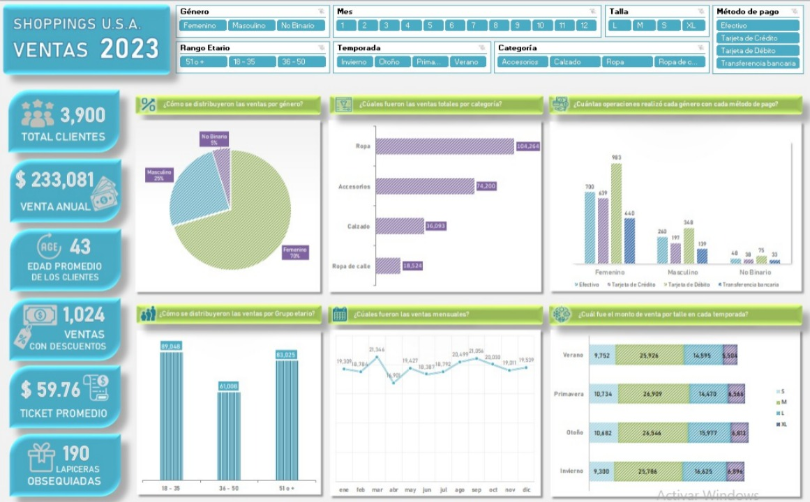
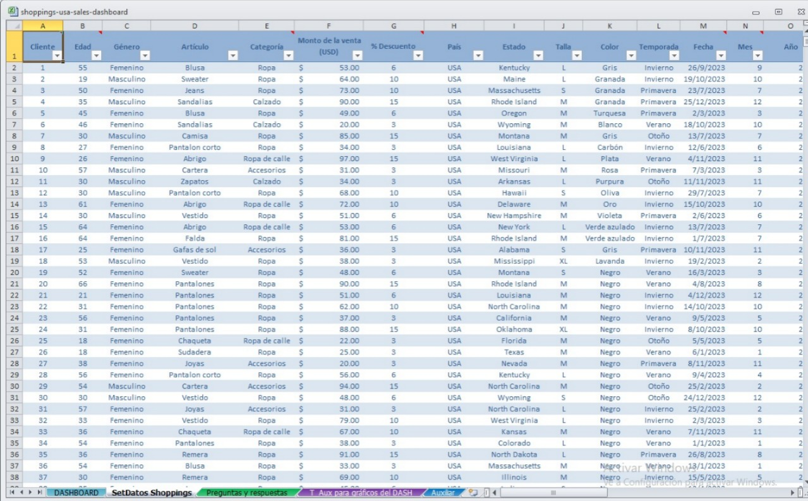
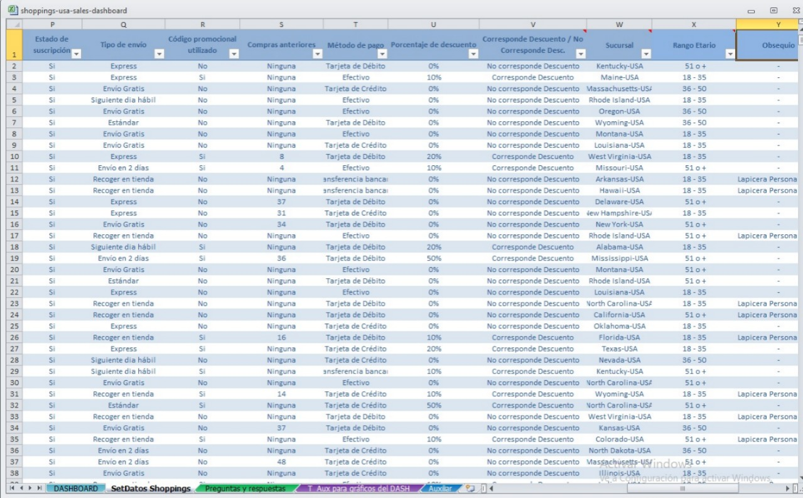
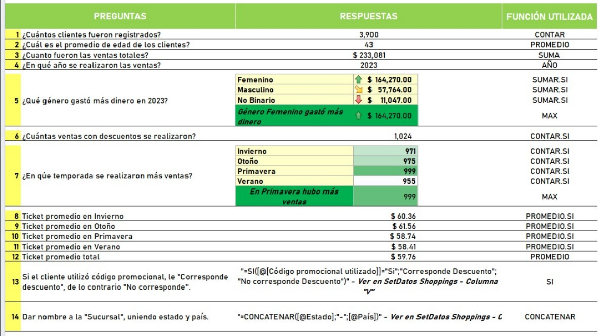
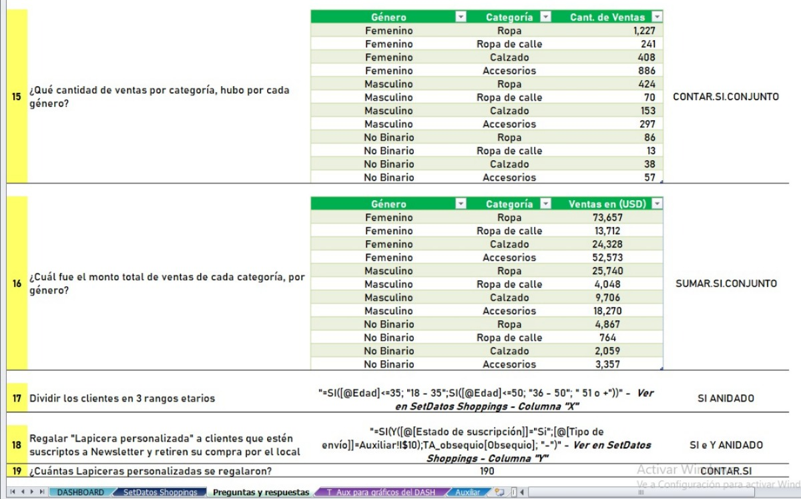
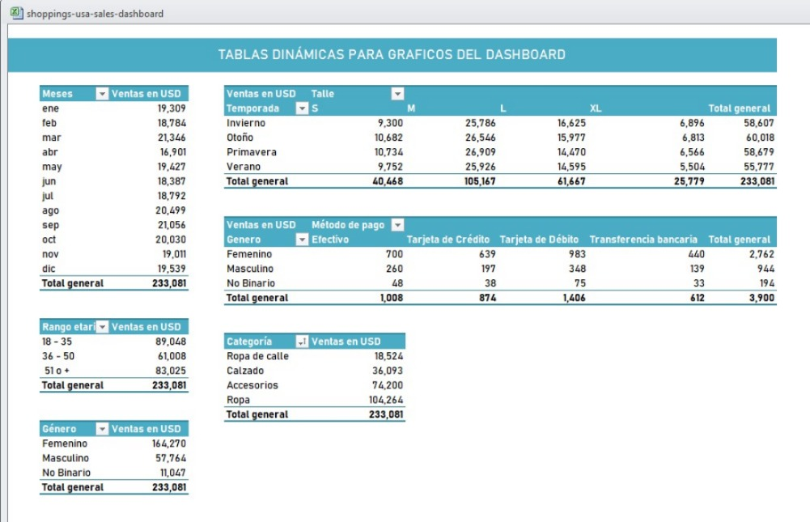
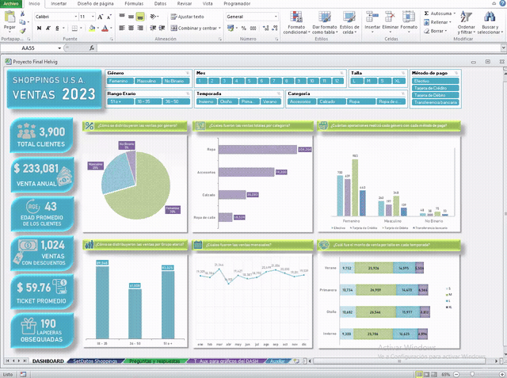

# 📊 Shoppings U.S.A. — Análisis de Ventas Retail 2023

Análisis end-to-end de ventas de una cadena de tiendas de ropa en Estados Unidos, desarrollado en **Excel** a partir de un dataset de [Kaggle](https://www.kaggle.com/datasets/iamsouravbanerjee/customer-shopping-trends-dataset). El proyecto abarca desde la limpieza y transformación de datos crudos hasta un dashboard interactivo con segmentadores.

## 🎯 Objetivo

Antes de tocar los datos, definí 5 preguntas de negocio que guiaron todo el análisis:

1. ¿Cómo se distribuyen las ventas por género y categoría de producto?
2. ¿Qué grupo etario genera más ingresos?
3. ¿Cómo varían las ventas a lo largo del año y por temporada?
4. ¿Qué métodos de pago prefiere cada segmento de clientes?
5. ¿Qué relación existe entre descuentos, envío y comportamiento de compra?

## 🗂️ Dataset

- **Fuente:** [Customer Shopping Trends Dataset](https://www.kaggle.com/datasets/iamsouravbanerjee/customer-shopping-trends-dataset) (Kaggle)
- **Naturaleza:** dataset sintético con estructura realista de ventas retail
- **Volumen:** 3.900 registros, 25 columnas
- **Contenido:** datos demográficos del cliente, artículo comprado, monto, método de pago, envío, temporada, entre otros

## ⚙️ Proceso

**1. Preparación de datos**
Sobre las columnas originales, agregué columnas calculadas para enriquecer el análisis:
- **Rango etario** (SI anidado): clasifica clientes en 18-35 / 36-50 / 51+
- **Sucursal** (CONCATENAR): une Estado + País en un solo campo
- **Corresponde Descuento** (SI): identifica si el cliente usó código promocional
- **Obsequio** (SI + Y anidado): asigna una lapicera personalizada a clientes suscriptos a newsletter que retiran su compra en el local

**2. Tablas de validación y búsqueda (BUSCARV)**
Armé tablas auxiliares para asegurar consistencia de datos: relación Artículo→Categoría, y rangos de descuento según monto de venta.

**3. Preguntas de negocio respondidas con fórmulas**
19 preguntas respondidas y documentadas, cada una con su función correspondiente:

| Función | Uso |
|---|---|
| `CONTAR` / `PROMEDIO` / `SUMA` | Métricas generales (clientes, edad promedio, ventas totales) |
| `SUMAR.SI` / `CONTAR.SI` | Ventas y conteos por género y temporada |
| `PROMEDIO.SI` | Ticket promedio por temporada |
| `SUMAR.SI.CONJUNTO` / `CONTAR.SI.CONJUNTO` | Cruces de género × categoría |
| `SI` anidado | Segmentación de clientes en rangos etarios |
| `SI` + `Y` anidado | Lógica condicional compuesta (obsequios) |
| `CONCATENAR` | Creación de campo Sucursal |

**4. Tablas dinámicas de soporte**
Construí tablas dinámicas para alimentar cada gráfico del dashboard (ventas por mes, por talle y temporada, por método de pago y género, por categoría, por rango etario).

**5. Dashboard interactivo**
Diseñé un dashboard con 6 gráficos y 7 segmentadores (género, mes, talla, método de pago, rango etario, temporada, categoría) que permiten explorar los datos de forma dinámica.

## 📈 Principales hallazgos

- El género **Femenino** concentra el **70%** de las ventas ($164.270 de $233.081 totales)
- La categoría **Ropa** es la más vendida ($104.264), seguida de Accesorios ($74.200)
- El rango etario **18-35 años** es el que más genera ingresos ($89.048)
- **Primavera** fue la temporada con más ventas (999 operaciones)
- Se entregaron **190 lapiceras personalizadas** como obsequio a clientes suscriptos que retiraron su compra en tienda

## 🛠️ Herramientas

Excel (funciones condicionales anidadas, BUSCARV, tablas dinámicas, segmentadores, formato condicional)

## 📁 Estructura del repositorio

📬 Contacto: https://www.linkedin.com/in/virginia-elizabeth-helvig/
